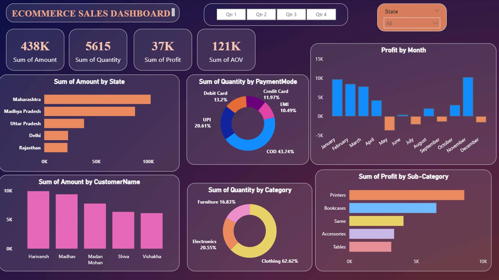

# Ecommerce-Sales-Dashboard

An interactive E-commerce Sales Dashboard created using Power BI to analyze online sales data, track sales performance, profit, customer behavior, and regional trends using dynamic visualizations, filters, and slicers for better business decision-making.

---

## Ecommerce Sales Dashboard

This project is created using Power BI for analyzing online sales data.

---

## Features

- Interactive dashboard  
- Sales and profit analysis  
- Category-wise and region-wise sales  
- Filters and slicers for drill-down analysis  
- Different visualizations like bar chart, pie chart, donut chart, map, and line chart  

---

## Tools Used

- Power BI  
- Excel  
- Data Visualization Techniques  

---

## Dashboard Screenshot

---

## Project Learnings

- Data cleaning and transformation  
- Dashboard design  
- Business insights generation  
- User-driven parameter customization  

---
